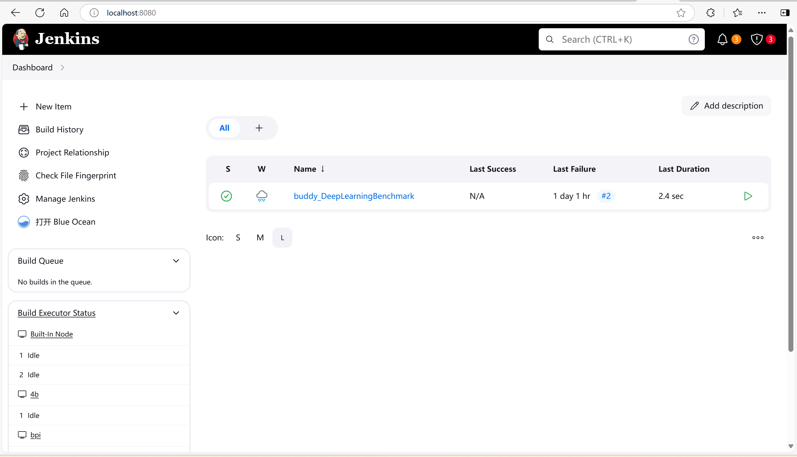

# Testing Platform
This testing platform is built on a Jenkins Docker image, designed to automate the building of the Buddy-Benchmark project and manage other testing tasks for the Buddy-Compiler community.

## Getting Started

### Clone buddy-benchmark
```bash
$ git clone https://github.com/buddy-compiler/buddy-benchmark.git
```

### Configure slave nodes
Slave nodes are used to perform test tasks and usually consist of development boards of RISC-V architecture or ARM architecture.

You can choose to configure slave nodes during the initial build of the platform. You can also skip this step and configure the nodes manually in the Jenkins web page.

```bash
$ cd buddy-benchmark/ci/jenkins
$ touch config.properties
```

`config.properties` is used to hold slave node information. You need to write the file in the following format
```properties
# The nodeName is used to distinguish between different nodes 
# And is also used as the label of the agent in the pipeline task


# the host address of the node
  nodeName.host=

# The port on which Jenkins connects to the node, since it takes an ssh connection, you can fill in 22 here. 
  nodeName.port=

# Username and password that can be used to log in using ssh
  nodeName.username=
  nodeName.password=

# The working directory where the node executes Jenkins test tasks. 
# You should ensure that this path exists in the device and that the logged in user has read, write, and execute permission
  nodeName.remoteFS=       

```


### Setting up
```bash
$ cd buddy-benchmark/ci/
$ docker compose up
```


After running the command, you will get the ci-jenkins image, and the container will start. You will be able to access the Jenkins web page on port 8080 in your machine.



If you have configured the config.properties file, the slave nodes will be listed on the left, and you will also find that a test job named buddy_DeepLearningBenchmark already exists.

Before you build this test job, you need to make a little change to the code. For a detailed description of the test file and the use of the platform, please refer to the [userManual](userManual.md).


