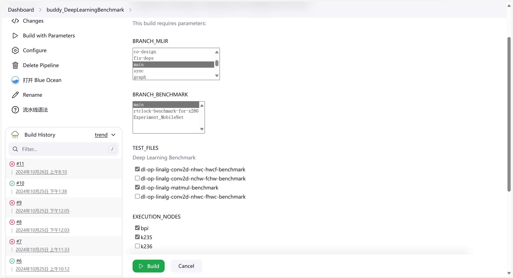
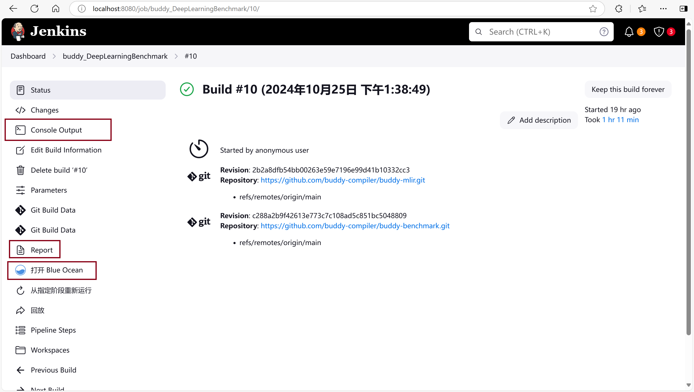
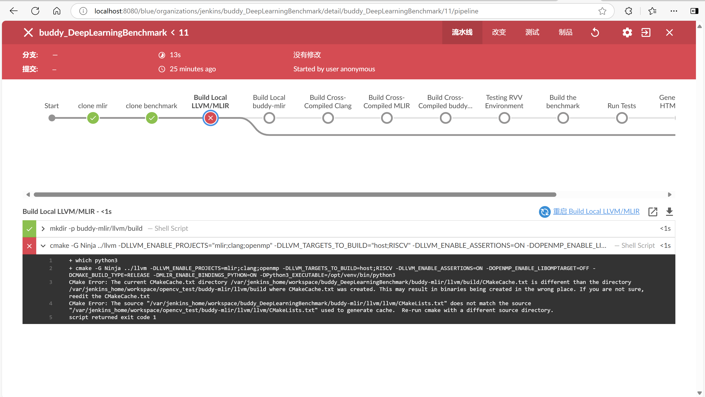
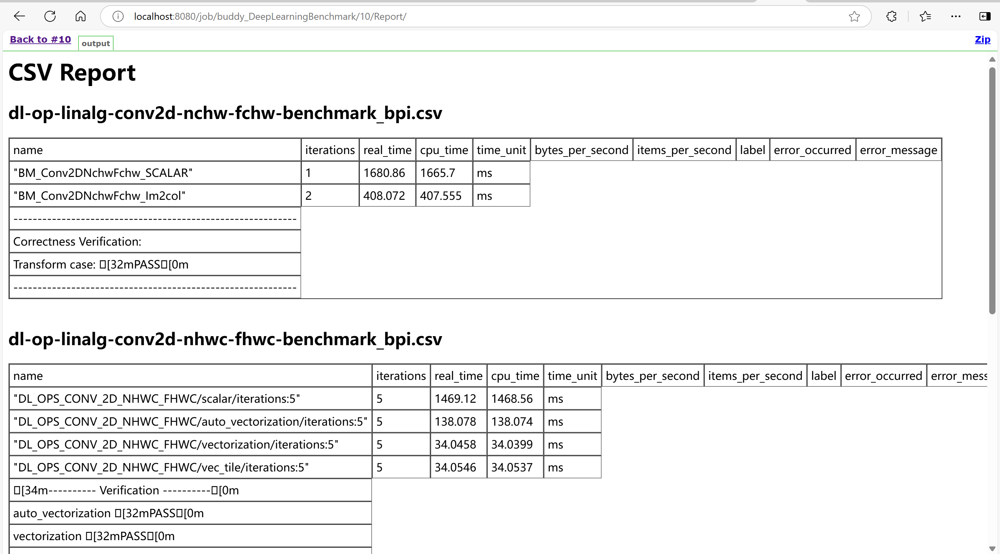

# Platform overview


The test platform is mainly composed of Jenkins master nodes and Jenkins slave nodes.
- **The Jenkins master node**, or Jenkins server, is responsible for managing all configurations and scheduling tasks. And it is also responsible for the main build tasks, as it is configured with all the tools. The Jenkins master node is based on the [official jenkins docker image](https://hub.docker.com/r/jenkins/jenkins) , and the dockerfile is in `jenkins` directory.
- **The Jenkins slave nodes**, or work agents, are RISC-V or ARM-based development boards that execute tests and output benchmark results. You can choose to configure slave nodes during the initial build of the platform, as described in  [README.md](../docs/README.md) . You can also choose to configure the nodes manually on the jenkins page, as shown in the [Manual configuration of nodes](#manual-configuration-of-nodes).


### Jenkins Data Volume

The Jenkins data volume configuration allows for the preservation of historical data from the Jenkins container, ensuring that previous test records are retained even if the container is rebuilt. When setting up Jenkins with `docker-compose up`, it wii automatically configures the data volume. 

Within the Jenkins container, data is stored in the `/var/jenkins_home` path, but on the host machine, this volume typically resides in Docker's default data volume path. 


### Extending the Platform with Compilers

The current platform setup includes only the Jenkins image and container, enabling basic buddy-benchmark CI tasks. In anticipation of future needs for compiler support (such as LLVM and GCC),  the `compiler-containers` directory is included with Docker image files for building these compilers. To enable these additional compilers:

1. **Edit `docker-compose.yml`**: Uncomment the configuration lines related to these compiler images. This allows `docker-compose up` to build a platform with integrated llvm, gcc and riscv-gnu-toolchain.

2. **Example Test File**: The `jenkins` directory includes a sample test file, `jenkinsfileOpencv`, which demonstrates how to use different compiler within the testing platform.

   

------


# Manual configuration of nodes

The following is an example of how to configure a slave node manually in the Jenkins interface, using the Banana Pie BPI-F3 as an example.
Before configuration you need to install ssh and java environment on these devices

### Create Credentials

Click `Dashboard > Manage Jenkins > Credentials > system > Global credentials (unrestricted) > add Credential` to bring up the Create Credentials page.


Credentials are used for SSH connections and can be either a username password, or an SSH key. Here we use username with password. Under `Kind`, check `Username with password`, fill in the account number and password that can login to BPI-F3.

### Create Nodes

Click `Dashboard > Manage Jenkins > Nodes > New node` to create a node.


Fill in the node name and check `Permanent Agent` to enter the node configuration page.


Fill in the appropriate fields as required for node configuration. 

- `Remote root directory`：Specify the working directory of the slave node. Ensure that the directory exists and is readable, writable and executable by the login account.
- `Lables`：Used to identify nodes, you can specify execution nodes by specifying labels in a pipeline job.
- `Launch method`：Select the method to launch the node, here select Launch agent via SSH
  - `Host`：the hostname of the device
  - `Credentials`：Select the credentials that were successfully configured in the previous step


After the configuration is complete, you can view the information on the log page of the node.


------


# Pipeline job : buddy_DeepLearningBenchmark

The `buddy_DeepLearningBenchmark` Jenkins pipeline job is designed to test benchmarks compiled by the buddy-mlir specifically for RISC-V Vector Extension.  It follows the testing processes outlined in the [RVV Environment Guide](https://github.com/buddy-compiler/buddy-mlir/blob/main/docs/RVVEnvironment.md) and the [Deep Learning Benchmark README](https://github.com/buddy-compiler/buddy-benchmark/blob/main/benchmarks/DeepLearning/README.md) .


### Create test jobs

This pipeline job should exist in the Jenkins web page when the platform build is complete. If not, you can also create a pipeline job yourself via the Jenkins web page.

Click `New Item` to create a new test job. Select `Pipeline` to create a pipeline project.


Write the test file script in jenkinsfile in the `Script` section and check `Use Groovy Sandbox`. The code used for this test is stored in [jenkinsfileBuddy](../jenkins/jenkinsfileBuddy).

Save the task, then click `Build Now` to start the first build. 

### Select parameter
This job enables parameterized builds with custom configurations for branch selection,  execution nodes, and test files.

**Remember!** For parameterized projects, complete an initial build so that the parameter selection screen appears for subsequent builds.

In the parameter selection screen, configure the following options:

- `BRANCH_MLIR`: Choose the branch of the `buddy-mlir` repository to test.
- `BRANCH_BENCHMARK`: Choose the branch of the `buddy-benchmark` repository.
- `TEST_FILES`: Select test files to execute.
- `EXECUTION_NODES`: Select nodes for executing these test files.




### Modify the jenkinsfile

To support execution node parameterization, the following code is written in the parameter section of JenkinsfileBuddy.

```groovy
extendedChoice(
    name: 'EXECUTION_NODES',
    type: 'PT_CHECKBOX',
    description: 'Select nodes for test execution',
    multiSelectDelimiter: ',',
    value: 'node1,node2,node3', // Replace with your actual node labels
    defaultValue: 'node1' // Replace with your default node label
)
```

This extendedChoice named `EXECUTION_NODES` allows you to select the Jenkins slave nodes on which the tests will be executed. The following fields need to be customized to ensure the pipeline runs on the correct nodes:

- `value`: This field should contain a comma-separated list of labels for the nodes available for test execution. Update it with the labels of the nodes you’ve set up in Jenkins. 
- `defaultValue`: This specifies the default node that will be pre-selected for the tests. Set this to the label of the most commonly used node.


### Review build results

Once the build completes, you can access the build history on the left panel to review the job results, detailed logs, and generated reports for each run.



`Console Output` provides a complete log of the job execution. Additionally, `Blue Ocean` offers a user-friendly interface for visualizing each pipeline stage. This view allows you to monitor the progress of every step and quickly locate errors.



After a successful build, the `Report` shows the benchmark results, which giving performance metrics and outcomes of each test in table.




The buddy-benchmark project, built on google benchmark, generates performance data in both CSV and JSON formats. In this pipeline job, commands are executed to first generate CSV files. e.g. `./dl-op-linalg-matmul-benchmark --benchmark_format=csv > result.csv"`

A simple script then summarizes these CSV files and converts them into a single HTML report. You can customize this script for more visual representation.

Finally, the HTML Publisher Plugin in Jenkins is used to publish the generated HTML report, allowing easy access to benchmark results for direct analysis in the Jenkins interface.