# 平台搭建

测试平台主要由 Jenkins 主节点和 Jenkins 从节点组成：

- Jenkins 主节点，即 Jenkins 服务器，负责管理所有配置以及任务的调度等

- Jenkins 从节点，即工作代理，由主节点指挥执行实际的构建任务

为方便管理和部署，Jenkins 主节点和编译工具使用 Docker 容器安装，从节点的配置整合到 Jenkins 容器中。所有容器使用 docker compose 统一部署

[compiler-containers](compiler-containers) 目录下保存了编译工具的镜像制作文件 `Dockerfile`，制作镜像时通过指定参数构建不同版本。容器启动后编译工具以数据卷的形式保存到宿主机上，供 Jenkins 主节点使用。构建参数和数据卷保存路径的具体设置参见 `docker-compose.yml` 文件

[Jenkins 目录](jenkins) 下包含一个镜像文件 `Dockerfile` 、插件列表 `plugins.txt`、创建节点脚本 `createNode.groovy`、创建测试任务脚本 `createJob.groovy` 以及测试任务用到的 `jenkinsfile`。整个镜像在 [Jenkins 官方镜像](https://github.com/jenkinsci/docker/blob/master/README.md) 的基础上添加了一些插件、从设备节点、以及创建了一个测试任务 opencv_test，测试任务详见 [测试用例](#测试用例) 一节

使用下列命令搭建平台：

```
docker-compose up
```

平台启动后，访问宿主机 `http://localhost:8080` 查看 Jenkins web 页面：

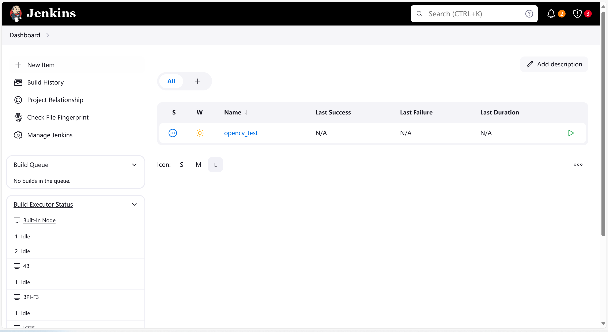

## 自动配置从节点设备
注意，若想使用 `createNode.groovy` 脚本自动配置设备节点，在搭建平台前需要在 `./jenkins/` 下创建 `config.properties`文件，用于保存从设备信息。文件格式如下：
```
#  节点名.host=
#  节点名.port=
#  节点名.username=
#  节点名.password=
#  节点名.remoteFS=       # Jenkins 工作目录，确保该路径在从设备中存在，登录用户具有读写权限
```


------


# 手动配置设备节点

平台使用过程中可能会出现增加节点的需求，下面以香蕉派 BPI-F3 为例子，介绍在 Jenkins 界面手动配置设备节点步骤。假设设备已安装 java 环境以及 ssh

## 创建凭证

在 Jenkins 面板中依次点击 `Dashboard > Manage Jenkins > Credentials > system > Global credentials (unrestricted) > add Credential` 出现创建凭证页面，如下所示：

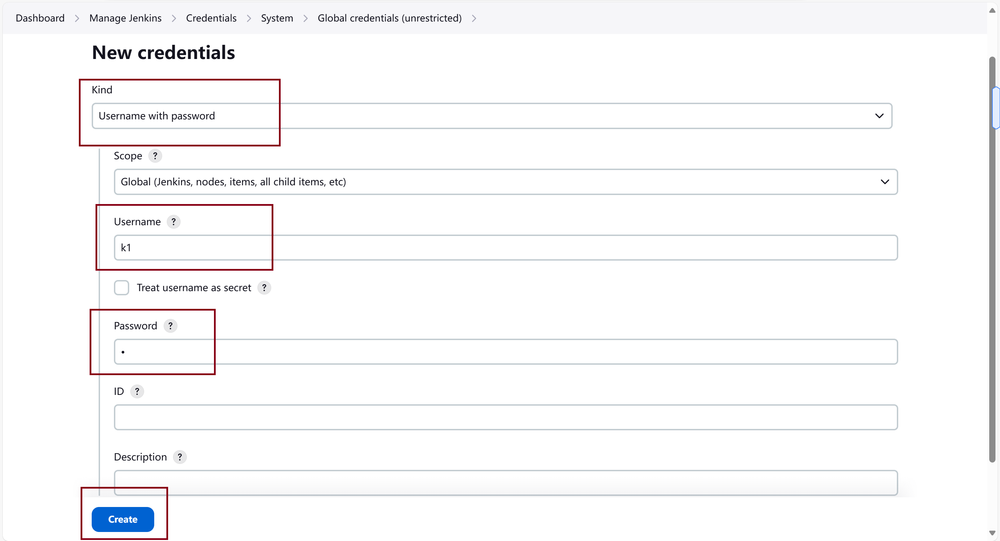

凭证用于SSH连接，可以是用户名和密码、SSH密钥等，这里使用用户名加密码的方式。在 `Kind` 下选中 `Username with password`，填入可以登录 BPI-F3 的账号和密码

## 创建节点

在 Jenkins 面板中依次点击 `Dashboard > Manage Jenkins > Nodes > New node` 创建节点，如下所示：

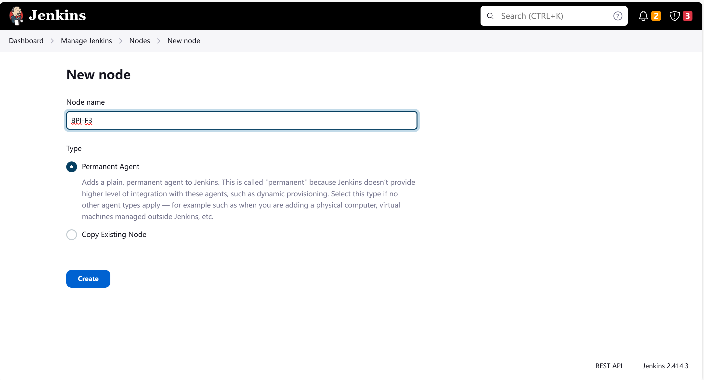

填入节点名称，并勾选 `Permanent Agent`，进入节点配置页面：

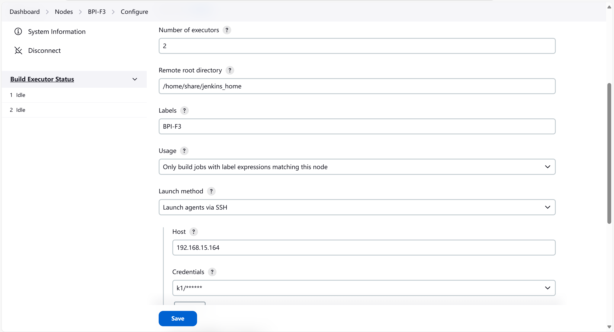

- `Number of execution`：表示节点上可以同时运行的并行作业数量
- `Remote root directory`：指定 Jenkins 的工作目录。设置时注意该目录的权限，确保 Jenkins 对其可写可执行
- `Lables`：用于标识节点，可以在作业配置中指定使用某个特定标签的节点来执行作业
- `Usage`：确定 Jenkins 如何使用此节点
- `Launch method`：选择如何启动节点，这里选择 Launch agent via SSH
  - `Host`：填入SSH主机名
  - `Credentials`：选择上一步配置成功的凭据

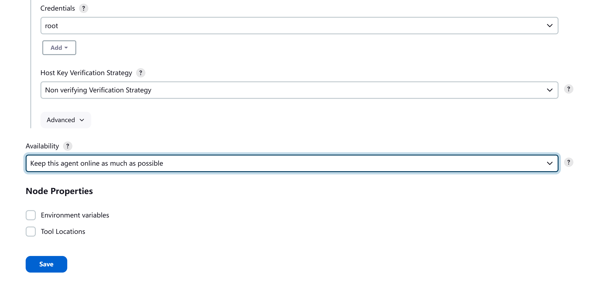

- `Host Key Verification Strategy`：配置SSH连接的主机密钥验证策略，这里选择 `Non-verifying Verification Strategy`（不进行验证）
- `Availability`：控制节点的可用性

配置完成后，可以在节点的 log 页面查看相关信息


------


# 测试用例

测试用例 opencv_test 以 [OpenCV](https://github.com/opencv/opencv) 面向 RISC-V 平台的交叉编译为例，支持用户选择仓库的不同分支、构建工具、测试文件以及负责执行的 RISC-V 设备。下面介绍在 Jenkins 中手动设置测试任务步骤，以及整个任务的测试流程

## 手动设置测试任务

点击 Jenkins 主页面 New Item，新建一个测试任务，并选择 Pipeline 以创建一个流水线项目

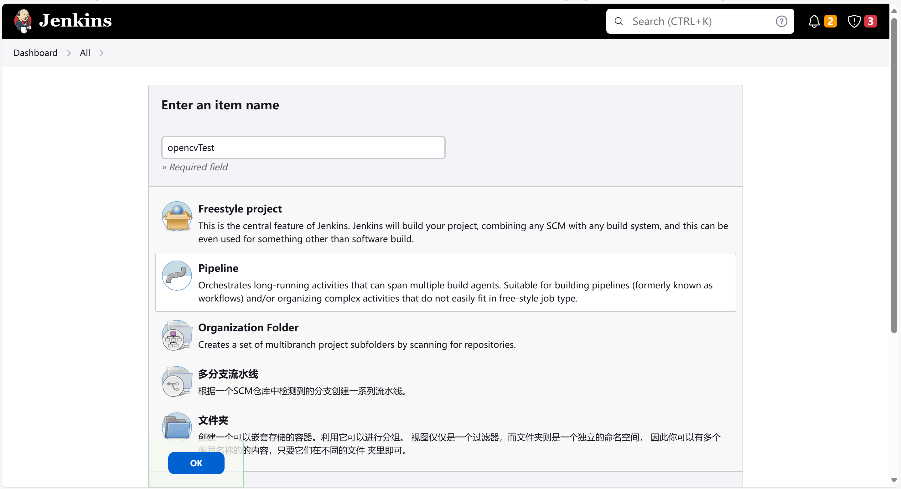

在 Script 处编写测试文件 Jenkinsfile，并勾选 Use Groovy SandBox

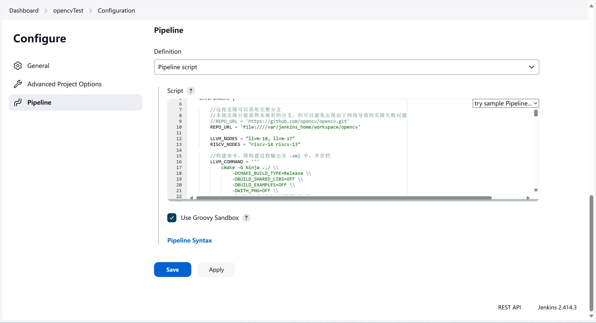

保存后点击左侧 Build Now 开始构建。带参数的项目配置完成后需要先构建一次， 第二次构建才会出现参数选择界面

在下方的参数构建页面中，

- BRANCH_1 与 BRANCH_2：选择 opencv 被构建的两个不同分支
- BUILD_NODE：选择构建工具，当前支持 llvm-18、llvm-17、riscv-13、riscv-14
- ARCHIVE_FILES：选择被测试的构建产物，支持多选
- EXECUTION_NODES：选择执行测试文件的节点，支持多选

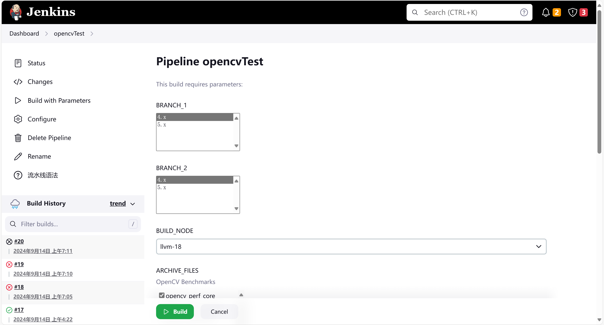

左侧上方可以对项目进行构建、配置、删除、重命名等操作，下方是构建历史，点进历史可以看到每次构建的详细信息

一次成功的构建会存档构建产物和 xml 格式的报告。例如，`a1_opencv_perf_core_BPI-F3.xml` 表示分支一构建出的测试文件 `opencv_perf_core` 在设备 BPI-F3 上的执行报告；目录 `build_4.x_riscv-14` 中会存放使用 riscv-14 编译的 4.x 分支的产物

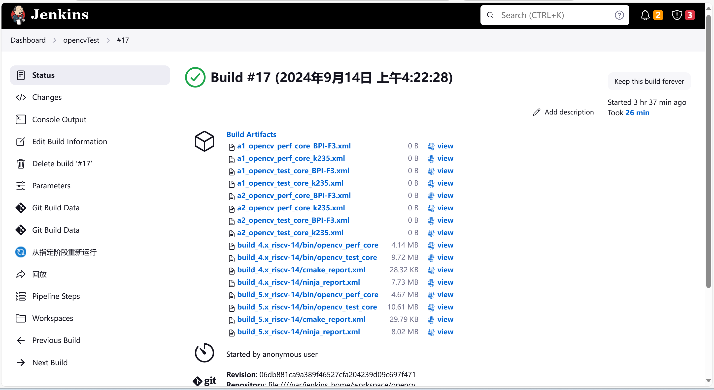

点击 Console Output 可以看到完整的执行日志

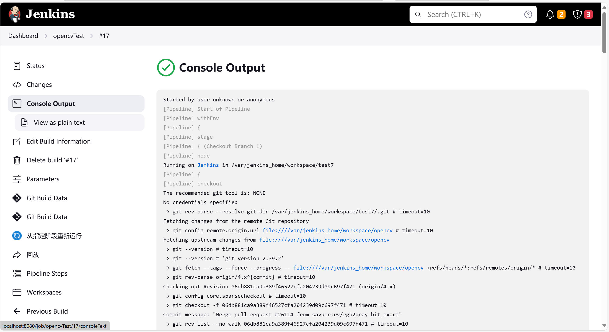


## OpenCV 测试任务代码详解


### Jenkinsfile 基本结构

Jenkinsfile 基于 Groovy 语法编写，是用来定义 Jenkins 自动化流水线的脚本，描述了项目的构建、测试和部署过程。Jenkinsfile 主要由 Pipeline、Agent、Stages 和 Steps 几个关键部分组成。下面给出了一个流水线的简单示例，进阶流水线语法知识可以参考 [官方流水线语法教程]([Pipeline Syntax (jenkins.io)](https://www.jenkins.io/doc/book/pipeline/syntax/))

```groovy
pipeline {
    agent none
    
    environment {
        REPO_URL = 'https://github.com/opencv/opencv.git' // 仓库地址
    }
	
	parameters {
        gitParameter branchFilter: 'origin/(.*)', defaultValue: '4.x', name: 'BRANCH', type: 'PT_BRANCH'
    }
	
    stages {
        stage('Checkout Branch') { // 阶段一：拉取代码
            steps {
				// 从Git仓库拉取
            	checkout([
                        $class: 'GitSCM',
                        branches: [[name: "${BARNCH}"]], // 拉取参数BRANCH所选定的分支
                        userRemoteConfigs: [[url: "${REPO_URL}"]] // 
                        extensions: [ cloneOption(shallow: true) ] // 浅克隆
                    ])
            }
        }
        
        stage('Build') { // 阶段二：构建项目
            steps {
            	sh 'echo "Building the project..."' // 使用 shell 命令构建项目
            }
        }
        
        stage('Archive') { // 阶段三：存档构建产物
            steps {
            	sh 'echo "Archiving ..."' 
            }
        }
        
        stage('Test') {// 阶段四：测试
            steps {
            	sh 'echo "Running tests..."' // 使用 shell 命令运行测试
            }
        }
    }
}
```

- **`pipeline {}`**：表示整个流水线，包含流水线所有的阶段和步骤

- **`agent any`**：`agent` 指定在哪个节点中运行流水线，可以是特定机器、Docker 容器等。`none` 则表示不分配任何节点，每个阶段的执行节点可能不同，可以在后面不同阶段中重新定义 `agent`

- **`environment`** ：用于定义环境变量。环境变量可以在流水线的各个阶段中使用，通常用来存储一些全局信息。这里定义了变量 `REPO_URL` ，用来存储仓库地址

- **`parameters`**：定义在执行流水线时，用户可以提供的输入值（参数），参数可以用来动态配置流水线的运行行为。这里的`gitParameter branchFilter` 定义了 `BRANCH` 参数，用于选择拉取的仓库分支

- **`stages {}`**：表示流水线的各个阶段，每个阶段对应一个步骤

- **`steps {}`**：每个阶段的具体操作，步骤可能是运行脚本、调用工具、执行命令等

- **`stage('Checkout Branch')`**：定义一个名为 `Check out` 的阶段，该阶段从 Git 仓库拉取代码

流水线分为拉取代码（Checkout Branch）、构建（Build）、存档（Archive）以及测试（Test）四个阶段，整个测试文件将在这个基础上补充完整


### 1. 拉取代码 Checkout

```groovy
        stage('Checkout') { // 克隆所选分支
            agent {
                label 'JenkinsNode'
            }
            
            steps {
                checkout([
                        $class: 'GitSCM',
                        branches: [[name: "${BRANCH}"]],  // BRANCH 参数供用户选择分支
                        userRemoteConfigs: [[url: "${REPO_URL}"]] // 
                        //可选：浅克隆
                        //extensions: [ cloneOption(shallow: true) ]
                    ])
            }
        }
```

使用 Git Parameter 插件定义 `BRANCH` 参数选择拉取的分支，同时定义了环境变量 `REPO_URL` 保存仓库地址。由于网络问题，可能构建前无法获取到分支列表，或者构建时拉取代码失败。可以预先将仓库克隆到服务器上，将 `REPO_URL` 替换为本地路径，规避网络问题并且节约构建时间

使用本地克隆存在一定的安全问题，因此需要在 Jenkins 中进行配置。在Scritpt Console 中输入下列命令：

```groovy
hudson.plugins.git.GitSCM.ALLOW_LOCAL_CHECKOUT = true
```

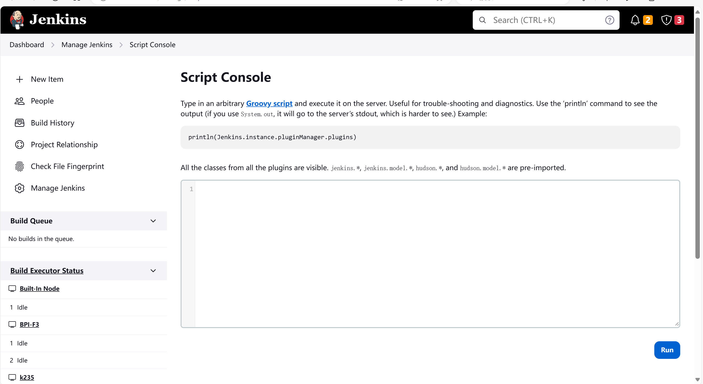


### 2. 构建 Build

目前支持的编译工具有 llvm 以及交叉编译工具链 riscv-gnu，因此在参数 `parameters` 一节新添参数 `BUILD_NODE`，选项名即为编译工具所在的目录，例如 llvm-18 表示 18.1.7 版本的 llvm 编译工具存放在 `/home/share/opt/llvm-18` 目录下.（路径`/home/share/opt/` 可在 docker-compose 中修改）

```groovy
parameters {
        // 构建节点参数，用于选择不同构建工具
        choice choices: ['llvm-18', 'llvm-17', 'riscv-13', 'riscv-14'], name: 'BUILD_NODE'
    }
```

在构建阶段中，首先新建构建目录 `build_${BRANCH_1}_${BUILD_NODE}` ，例如 `build_4.x_llvm-18`，后续存档的构建产物和报告都放在该目录下

```groovy
stage('Build') { // 构建阶段
            agent {
                label 'JenkinsNode'
            }

            steps {
                script { 
                    def buildDir = "build_${BRANCH_1}_${BUILD_NODE}" //构建目录，方便后续存档
                    sh "rm -rf ${buildDir}" 
                    sh "mkdir ${buildDir}" 
                    dir("${buildDir}"){
                        if (LLVM_NODES.contains(BUILD_NODE)) {//执行 llvm 的编译命令
                            sh """
                                ${LLVM_COMMAND}
                                ${NINJA_COMMAND}
                            """
                        } else if (RISCV_NODES.contains(BUILD_NODE)) {//执行 riscv 的编译命令
                            sh """
                                ${RISCV_COMMAND}
                                ${NINJA_COMMAND}
                            """
                        }
                    }
                }
            }
        }
```

两类编译工具命令不同，因此需要分别处理，将编译命令放入环境变量中方便修改。下列命令将构建过程输出到 `.xml` 文件中：

```groovy
environment {
        
        LLVM_NODES = "llvm-18, llvm-17"
        RISCV_NODES = "riscv-14 riscv-13"

        //构建命令，将构建过程输出至 .xml 中，方便存档
        LLVM_COMMAND = """
            cmake -G Ninja ../ \\
                -DCMAKE_BUILD_TYPE=Release \\
                -DBUILD_SHARED_LIBS=OFF \\
                -DBUILD_EXAMPLES=OFF \\
                -DWITH_PNG=OFF \\
                -DOPENCV_ENABLE_NONFREE=ON \\
                -DWITH_OPENCL=OFF \\
                -DCMAKE_TOOLCHAIN_FILE=../platforms/linux/riscv64-clang.toolchain.cmake \\
                -DRISCV_CLANG_BUILD_ROOT=/opt/${BUILD_NODE} \\
                -DRISCV_GCC_INSTALL_ROOT=/opt/riscv_13 \\
                -DCPU_BASELINE=RVV \\
                -DCPU_BASELINE_REQUIRE=RVV \\
                -DRISCV_RVV_SCALABLE=ON >> cmake_report.xml 2>&1
                """
        RISCV_COMMAND = """
            cmake -GNinja ../ \\
                    -DTOOLCHAIN_COMPILER_LOCATION_HINT=/opt/${BUILD_NODE}/bin \\
                    -DCMAKE_BUILD_TYPE=Release \\
                    -DBUILD_SHARED_LIBS=OFF \\
                    -DWITH_OPENCL=OFF \\
                    -DCMAKE_TOOLCHAIN_FILE=../platforms/linux/riscv64-gcc.toolchain.cmake \\
                    -DRISCV_RVV_SCALABLE=ON \\
                    -DCPU_BASELINE=RVV \\
                    -DCPU_BASELINE_REQUIRE=RVV >> cmake_report.xml 2>&1
            """
        NINJA_COMMAND = ''' ninja >> ninja_report.xml 2>&1'''
    }
```


### 3. 存档 Archive

OpenCV 构建完成的测试文件放在 `构建目录/bin/ ` 下。测试文件众多，因此新增文件选择参数 `ARCHIVE_FILES`，支持仅选择其中几个测试文件进行测试：

```groovy
parameters {
       // 构建文件参数，用于选择测试的文件，多选
        extendedChoice(
            name: 'ARCHIVE_FILES',
            type: 'PT_CHECKBOX',
            description: 'OpenCV Benchmarks',
            multiSelectDelimiter: ',',
            value: 'opencv_perf_core,opencv_perf_imgproc,opencv_perf_dnn,opencv_test_core,opencv_test_imgproc,opencv_test_dnn', // 选项值
            defaultValue: 'opencv_perf_core,opencv_test_core' // 默认值
        )
    }
```

存档阶段将用户选择的测试文件以及报告存档（archiveArtifacts），便于后续查看。同时暂存（stash）测试文件，留至下一阶段测试。代码如下：

```groovy
stage('Archive'){ // 存档
            agent {
                label 'JenkinsNode'
            }
            steps {
                script {
                    def buildDir = "build_${BRANCH_1}_${BUILD_NODE}" 
                    archiveArtifacts artifacts: "${buildDir}/*.xml"  // 存档构建报告
                    def files = ARCHIVE_FILES.split(',')
                    files.each { file ->
                        archiveArtifacts artifacts: "${buildDir}/bin/${file}" // 存档测试文件，便于以后查看
                    }
                    dir("${buildDir}/bin"){
                        stash name: 'archivedFiles_1', includes: "${ARCHIVE_FILES}" //暂存测试文件，下一阶段使用
                    }
                    sh "rm -rf ${buildDir}" // 删除构建目录
                }
            }
        }
```

`archiveArtifacts` 用于将文件永久保存到 Jenkins 服务器上，以便后续查看和下载。文件存档后可以通过 Jenkins 的构建记录访问，即使流水线结束后依然可用。在服务器/容器中的存档路径为 `${JENKINS_HOME}/jobs/${JOB_NAME}/builds/${BUILD_NUMBER}/archive` 

如图，每一次归档文件都放在一个单独的文件夹（以build号命名）里：

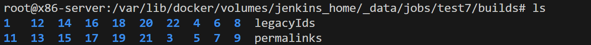

`stash` 用于在同一个流水线的不同节点或阶段之间临时传递文件，与存档不同，文件只是暂时存储在 Jenkins 中，只在流水线运行时有效


### 4. 执行 Test

执行阶段负责将之前暂存的文件发送到 RISC-V 设备上执行，并存档执行结果。新增参数 `EXECUTION_NODES`，支持用户选择多个RISC-V 设备

````groovy
    parameters {
        // 运行节点参数，用于选择测试文件的运行节点，多选
        extendedChoice(
            name: 'EXECUTION_NODES',
            type: 'PT_CHECKBOX',
            multiSelectDelimiter: ',',
            value: 'BPI-F3,k235,k236', // 选项值
            defaultValue: 'k235' //默认值
        )
    }
````

本阶段在多个节点上执行测试，因此不使用 `agent` 块定义执行节点，而是使用 `node()` 指定；使用 `unstash` 取回上个阶段暂存的文件，这些文件会被提取到当前工作目录中。

遍历这些工作节点，在每个节点上执行相关操作。这里使用 Shell 命令来运行，并将输出结果重定向到 `a1_${file}_${nodeLabel}.xml` 文件中。如当前处理的是 `opencv_perf_core` 文件，并且运行节点是 `k235`，则输出结果会被保存到 `a1_opencv_perf_core_k235.xml` 中。`|| true` 用来确保即使执行命令失败（如测试未通过），流水线也不会中断。代码如下：

```groovy
stage('Test') {
            steps {
                script {
                	// 获取用户选择的执行节点（通过参数传递），将其按逗号分割为数组
                    def nodes = params.EXECUTION_NODES.split(',')
                    nodes.each { nodeLabel -> // 遍历每个执行节点
                        node(nodeLabel) {
                            unstash 'archivedFiles_1' // 从之前暂存的文件中取回文件，准备在该节点上使用
                            def files = params.ARCHIVE_FILES.split(',')  // 获取用户选择要运行的文件
                            files.each { file -> 
                                // 执行文件，并将输出结果重定向到对应的 XML 文件中
                                sh "./${file} > a1_${file}_${nodeLabel}.xml || true"
                            }
                            archiveArtifacts artifacts: '*.xml' // 存档所有生成的 XML 文件（测试结果）
                            sh 'rm -rf *' // 删除节点上的所有文件，清理工作目录
                        }
                    }
                }
            }
        }
```

