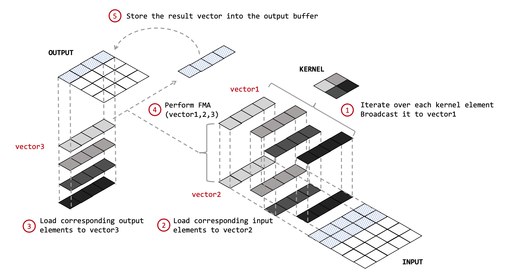

# Convolution Algorithms

## Coefficients Broadcasting Algorithm

The coefficients broadcasting algorithm has been proved to be a high performance implementation of 2D convolution.[[Ref]](https://ieeexplore.ieee.org/abstract/document/8324097)
Currently, this algorithm is implemented in the buddy-mlir project.
For more details, please see the [document about conv-opt tool in buddy-mlir](https://github.com/buddy-compiler/buddy-mlir/blob/main/docs/conv-opt.md).

The figure shows the steps of the algorithm:
- Iterate over each kernel element and broadcast it to vector1.
- Load a slice of the input into the vector2 with the iteration index.
- Load a slice of the output into the vector3 with the outermost loop iteration index.
- Multiply and accumulate the vector1, vector2, and vector3.
- Store the result vector into the output buffer with the outermost loop iteration index.
